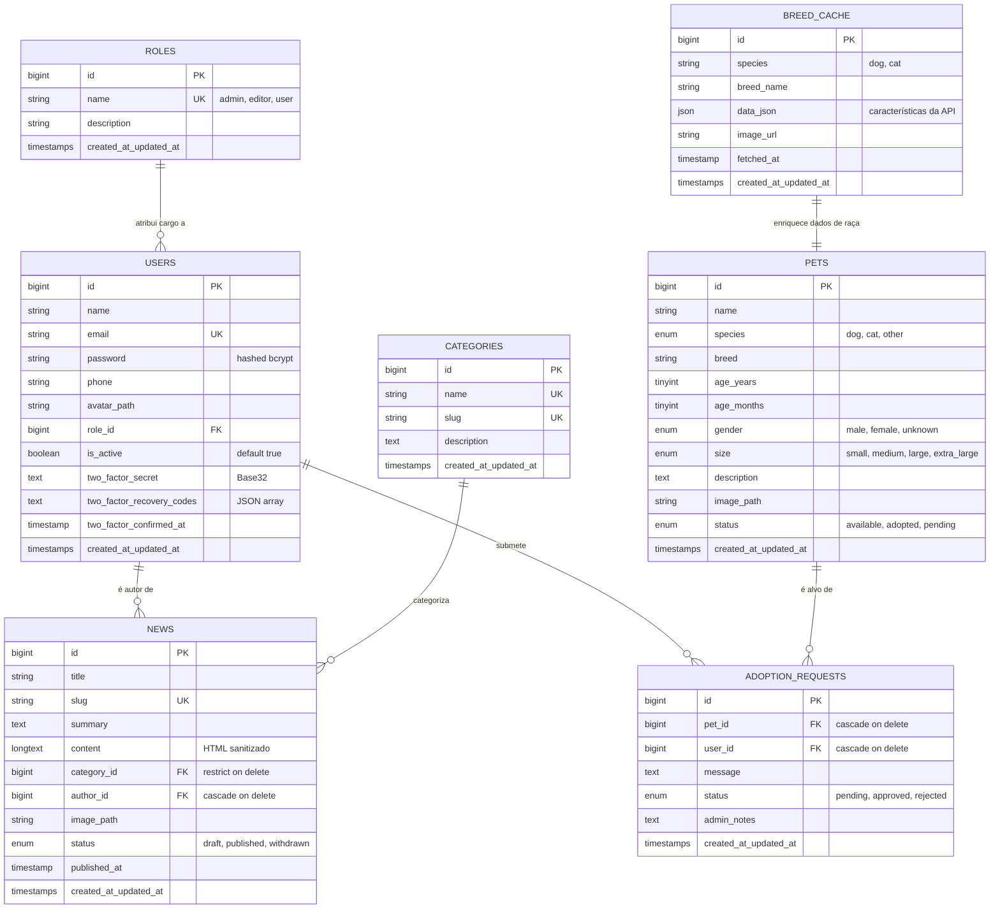
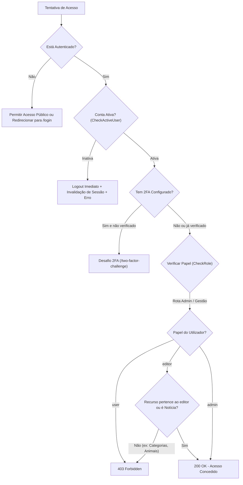

# 🐾 PawSafe — Documentação Exaustiva da Arquitetura e Código-Fonte

Este documento é a referência técnica integral e detalhada da aplicação **PawSafe**, uma plataforma web desenvolvida na framework **Laravel** concebida para a gestão moderna de abrigos de animais, facilitação de processos de adoção responsável, publicação e difusão de notícias/campanhas de sensibilização, disponibilização de uma API RESTful própria e integração com múltiplos serviços e APIs externas.

---

## 📑 Índice Geral

1. [Visão Geral & Stack Tecnológica](#1-visão-geral--stack-tecnológica)
2. [Estrutura de Diretórios e Mapeamento do Código](#2-estrutura-de-diretórios-e-mapeamento-do-código)
3. [Base de Dados, Esquema Relacional e Modelos Eloquent](#3-base-de-dados-esquema-relacional-e-modelos-eloquent)
4. [Camada de Serviços (Service Layer) & APIs Externas](#4-camada-de-serviços-service-layer--apis-externas)
5. [Autenticação, 2FA (TOTP) e Controlo de Acesso Baseado em Papéis (RBAC)](#5-autenticação-2fa-totp-e-controlo-de-acesso-baseado-em-papéis-rbac)
6. [Controladores e Lógica de Negócio (Controllers Breakdown)](#6-controladores-e-lógica-de-negócio-controllers-breakdown)
7. [API RESTful Própria (v1) & JSON Schema](#7-api-restful-própria-v1--json-schema)
8. [Camada de Apresentação (Blade, Quill.js & Multi-Idioma)](#8-camada-de-apresentação-blade-quilljs--multi-idioma)
9. [Segurança em Profundidade (Defense in Depth)](#9-segurança-em-profundidade-defense-in-depth)
10. [Testes Automatizados & Qualidade de Software](#10-testes-automatizados--qualidade-de-software)
11. [Guia de Instalação, Configuração e Execução](#11-guia-de-instalação-configuração-e-execução)
12. [Perguntas e Respostas para Defesa e Avaliação do Projeto](#12-perguntas-e-respostas-para-defesa-e-avaliação-do-projeto)

---

## 1. Visão Geral & Stack Tecnológica

O **PawSafe** resolve o desafio de gestão operacional de um abrigo de animais de companhia em conjunto com um portal público de sensibilização e adoção:

- **Portal Público Multilingue**: Catálogo interativo de animais para adoção com filtros dinâmicos (espécie, porte, género, pesquisa textual), fichas de animais enriquecidas com biografia de raças obtidas de APIs externas, submissão controlada de candidaturas de adoção, módulo de notícias com categorias e paginação, widget dinâmico assíncrono que consome a API própria da aplicação e páginas informativas institucionais.
- **Painel Administrativo CMS (`/admin`)**: Dashboard com indicadores em tempo real (KPIs de animais acolhidos, adotados, pedidos pendentes, artigos publicados e rascunhos), gestão completa de animais com uploads de fotos, fluxo de revisão e decisão de pedidos de adoção em transação atómica, gestão editorial de artigos com editor rich-text (Quill.js v2) e gestão de utilizadores com ativação/desativação de contas e atribuição de papéis.
- **API RESTful Versionada (`/api/v1`)**: Conjunto de endpoints normalizados com suporte a paginação, filtros, respostas semânticas (200, 201, 204, 400, 401, 403, 404), validação formal contra JSON Schema (draft 2020-12) e autorização por cargo.
- **Autenticação Avançada com 2FA (RFC 6238 TOTP)**: Sistema próprio em PHP puro de verificação em dois passos compatível com Google Authenticator, Authy e Microsoft Authenticator, com suporte a códigos de recuperação de emergência de uso único e confirmação obrigatória de ativação.

### Stack Tecnológica e Bibliotecas

| Componente | Tecnologia | Finalidade / Justificação |
|---|---|---|
| **Linguagem Backend** | PHP 8.2+ / 8.4 | Tipagem estrita, constructor property promotion, match expressions e performance. |
| **Framework Web** | Laravel 11 / 12 | Arquitetura MVC limpa, Eloquent ORM, sistema de migrations, middleware pipeline e rotas declarativas. |
| **Base de Dados** | SQLite / MySQL / PostgreSQL | Suporte nativo a migrações relacionais com chaves estrangeiras e integridade referencial. |
| **Frontend / Templates** | Blade Templating Engine | Renderização server-side rápida, herança de layouts, diretivas de controlo e proteção contra XSS via escaping automático. |
| **Editor Rich-Text** | Quill.js v2 (CDN) | Edição WYSIWYG moderna no browser sem necessidade de chaves de API pagas ou registo externo. |
| **Internacionalização** | Laravel Localization (`lang/`) | Suporte nativo a 3 idiomas completos: Português (`pt`), Inglês (`en`) e Croata (`hr`). |
| **APIs Externas** | TheDogAPI & TheCatAPI | Obtenção de fichas biográficas de raças (temperamento, peso, longevidade) e imagens de animais. |
| **API Externa de Imagem**| Pexels API & Unsplash CDN | Seleção de fotografias profissionais temáticas e contextuais para artigos de notícias. |
| **Autenticação 2FA** | RFC 6238 / RFC 4226 (TOTP) | Implementação interna de HMAC-SHA1 de 30 segundos sem dependências externas instáveis. |
| **Suíte de Testes** | PHPUnit / Pest / Laravel Testing | Testes de Feature cobrindo autenticação, autorização, API REST, 2FA e internacionalização. |

---

## 2. Estrutura de Diretórios e Mapeamento do Código

A organização do código segue rigorosamente o padrão MVC com a introdução de uma **Camada de Serviços (Services)** para isolamento de lógica externa:

```
NTPWS-26_27/
├── app/
│   ├── Http/
│   │   ├── Controllers/
│   │   │   ├── Admin/                      # Controladores da área administrativa
│   │   │   │   ├── AdminCategoryController.php  # CRUD de categorias com proteção de eliminação
│   │   │   │   ├── AdminNewsController.php      # Gestão editorial de notícias com Quill.js e sanitização
│   │   │   │   ├── AdminPetController.php       # Gestão de animais e decisões de adoção atómicas
│   │   │   │   ├── AdminUserController.php      # Gestão de papéis e desativação com expurgo de sessões
│   │   │   │   └── DashboardController.php      # Métricas e KPIs do abrigo em tempo real
│   │   │   ├── Api/
│   │   │   │   └── ApiNewsController.php        # Endpoints RESTful v1 (CRUD, filtros, paginação)
│   │   │   ├── Auth/
│   │   │   │   ├── AuthController.php           # Registo, login seguro e logout com regeneração de sessão
│   │   │   │   └── TwoFactorController.php      # Setup de 2FA, verificação de desafio e códigos de recuperação
│   │   │   ├── HomeController.php               # Página inicial, sobre e comutador de idioma (/locale)
│   │   │   ├── NewsController.php               # Listagem pública e visualização de artigos
│   │   │   ├── PetController.php                # Catálogo público, ficha de raça e submissão de adoção
│   │   │   └── ProfileController.php            # Perfil do utilizador, alteração de senha e avatar
│   │   └── Middleware/
│   │       ├── CheckActiveUser.php              # Desconecta utilizadores inativos em tempo de execução
│   │       ├── CheckRole.php                    # Validação de RBAC variádica (role:admin,editor)
│   │       └── SetLocale.php                    # Injeção global do idioma a partir da sessão HTTP
│   ├── Models/                                  # Entidades Eloquent e relações
│   │   ├── AdoptionRequest.php                  # Pedido de adoção com restrição única de candidatura
│   │   ├── BreedCache.php                       # Cache relacional das respostas da API de raças
│   │   ├── Category.php                         # Categoria com geração automática de slugs
│   │   ├── News.php                             # Artigo com estados editoriais e fallbacks de imagem
│   │   ├── Pet.php                              # Animal com biometria, fotos e estados de adoção
│   │   ├── Role.php                             # Papéis do sistema (admin, editor, user)
│   │   └── User.php                             # Utilizador com 2FA, avatar e métodos de autorização
│   └── Services/                                # Camada de Serviços (Lógica desacoplada)
│       ├── BreedService.php                     # Integração TheDogAPI / TheCatAPI com cache-first
│       ├── NewsImageService.php                 # Obtenção contextual de fotos via Pexels / Unsplash
│       ├── PetImageService.php                  # Resolução de imagens de animais com base na raça
│       └── TotpService.php                      # Algoritmo RFC 6238 TOTP puro em PHP (Base32, HMAC-SHA1)
├── bootstrap/
│   └── app.php                                  # Configuração de rotas, middlewares globais e exceções JSON
├── config/
│   └── services.php                             # Credenciais de APIs de terceiros (Dog, Cat, Pexels)
├── database/
│   ├── migrations/                              # 9 migrações estruturadas com integridade referencial
│   └── seeders/
│       └── DatabaseSeeder.php                   # Dados completos de teste (contas, notícias, animais)
├── lang/
│   ├── pt/messages.php                          # Dicionário de tradução em Português
│   ├── en/messages.php                          # Dicionário de tradução em Inglês
│   └── hr/messages.php                          # Dicionário de tradução em Croata
├── public/
│   ├── css/style.css                            # Folhas de estilo da aplicação
│   ├── images/flags/                            # Bandeiras vetoriais SVG (pt.svg, gb.svg, hr.svg)
│   └── schemas/
│       └── news-schema.json                     # JSON Schema oficial para validação de notícias
├── resources/
│   └── views/                                   # Vistas Blade estruturadas por módulos
├── routes/
│   ├── api.php                                  # Rotas da API REST (/api/v1)
│   └── web.php                                  # Rotas Web (públicas, autenticadas e admin)
└── tests/
    └── Feature/                                 # 33 testes cobrindo todas as funcionalidades críticas
```

---

## 3. Base de Dados, Esquema Relacional e Modelos Eloquent

### 3.1. Esquema Relacional e Diagrama ER

A base de dados é estritamente relacional, cumprindo os padrões de integridade referencial e normalização (3FN).


```mermaid
erDiagram
    ROLES ||--o{ USERS : "atribui cargo a"
    USERS ||--o{ NEWS : "é autor de"
    USERS ||--o{ ADOPTION_REQUESTS : "submete"
    CATEGORIES ||--o{ NEWS : "categoriza"
    PETS ||--o{ ADOPTION_REQUESTS : "é alvo de"
    BREED_CACHE ||--|| PETS : "enriquece dados de raça"

    ROLES {
        bigint id PK
        string name UK "admin, editor, user"
        string description
        timestamps created_at_updated_at
    }

    USERS {
        bigint id PK
        string name
        string email UK
        string password "hashed bcrypt"
        string phone
        string avatar_path
        bigint role_id FK
        boolean is_active "default true"
        text two_factor_secret "Base32"
        text two_factor_recovery_codes "JSON array"
        timestamp two_factor_confirmed_at
        timestamps created_at_updated_at
    }

    CATEGORIES {
        bigint id PK
        string name UK
        string slug UK
        text description
        timestamps created_at_updated_at
    }

    NEWS {
        bigint id PK
        string title
        string slug UK
        text summary
        longtext content "HTML sanitizado"
        bigint category_id FK "restrict on delete"
        bigint author_id FK "cascade on delete"
        string image_path
        enum status "draft, published, withdrawn"
        timestamp published_at
        timestamps created_at_updated_at
    }

    PETS {
        bigint id PK
        string name
        enum species "dog, cat, other"
        string breed
        tinyint age_years
        tinyint age_months
        enum gender "male, female, unknown"
        enum size "small, medium, large, extra_large"
        text description
        string image_path
        enum status "available, adopted, pending"
        timestamps created_at_updated_at
    }

    ADOPTION_REQUESTS {
        bigint id PK
        bigint pet_id FK "cascade on delete"
        bigint user_id FK "cascade on delete"
        text message
        enum status "pending, approved, rejected"
        text admin_notes
        timestamps created_at_updated_at
    }

    BREED_CACHE {
        bigint id PK
        string species "dog, cat"
        string breed_name
        json data_json "características da API"
        string image_url
        timestamp fetched_at
        timestamps created_at_updated_at
    }
```

### 3.2. Análise Detalhada das Migrações (`database/migrations/`)

1. [0001_01_01_000000_create_users_table.php](file:///d:/erasmus/ntp/NTPWS-26_27/database/migrations/0001_01_01_000000_create_users_table.php):
   - Cria a tabela `roles` com índice de unicidade em `name`.
   - Cria a tabela `users` com restrição de chave estrangeira `role_id` referenciando `roles(id)` com regra `restrictOnDelete()`. Isto impede que um papel seja eliminado se existirem utilizadores associados a ele.
   - Cria a tabela `sessions` que armazena `user_id`, `ip_address`, `user_agent`, `payload` e `last_activity`. Essencial para controlo de sessões ativas e invalidação remota.
2. [2024_01_02_000001_create_categories_table.php](file:///d:/erasmus/ntp/NTPWS-26_27/database/migrations/2024_01_02_000001_create_categories_table.php):
   - Define colunas `name` e `slug`, ambas com restrição única (`unique()`).
3. [2024_01_02_000002_create_news_table.php](file:///d:/erasmus/ntp/NTPWS-26_27/database/migrations/2024_01_02_000002_create_news_table.php):
   - `category_id`: Chave estrangeira para `categories` com `restrictOnDelete()`. Se uma categoria possuir notícias, a base de dados recusa a eliminação da categoria, satisfazendo a exigência do enunciado.
   - `author_id`: Chave estrangeira para `users` com `cascadeOnDelete()`.
   - `status`: Campo enumerado (`draft`, `published`, `withdrawn`) com índice dedicado para pesquisas ultra-rápidas.
   - `published_at`: Timestamp com índice para ordenação cronológica decrescente.
4. [2024_01_02_000003_create_pets_table.php](file:///d:/erasmus/ntp/NTPWS-26_27/database/migrations/2024_01_02_000003_create_pets_table.php):
   - Atributos tipados para animais: `species`, `breed`, `age_years`, `age_months`, `gender`, `size` e `status` (`available`, `adopted`, `pending`), com índices em `species` e `status`.
5. [2024_01_02_000004_create_adoption_requests_table.php](file:///d:/erasmus/ntp/NTPWS-26_27/database/migrations/2024_01_02_000004_create_adoption_requests_table.php):
   - **Restrição de Unicidade Composta**: `$table->unique(['pet_id', 'user_id'])`. Impede fisicamente na base de dados que o mesmo utilizador submeta múltiplos pedidos para o mesmo animal.
   - Ambas as chaves estrangeiras (`pet_id` e `user_id`) possuem `cascadeOnDelete()`.
6. [2024_01_02_000005_create_breed_cache_table.php](file:///d:/erasmus/ntp/NTPWS-26_27/database/migrations/2024_01_02_000005_create_breed_cache_table.php):
   - Armazenamento em cache de chamadas a APIs externas. Possui restrição de unicidade em `['species', 'breed_name']` e armazena o corpo estruturado no campo nativo `data_json` (tipo `json`).
7. [2024_01_02_000006_add_two_factor_columns_to_users_table.php](file:///d:/erasmus/ntp/NTPWS-26_27/database/migrations/2024_01_02_000006_add_two_factor_columns_to_users_table.php):
   - Adiciona colunas para 2FA: `two_factor_secret`, `two_factor_recovery_codes` (array em JSON) e `two_factor_confirmed_at`.

### 3.3. Análise Exaustiva dos Modelos Eloquent (`app/Models/`)

#### 1. `User` ([app/Models/User.php](file:///d:/erasmus/ntp/NTPWS-26_27/app/Models/User.php))
- **Herança**: `Illuminate\Foundation\Auth\User as Authenticatable`.
- **Casts**:
  ```php
  'email_verified_at' => 'datetime',
  'password' => 'hashed', // Hashing automático com bcrypt ao definir a password
  'is_active' => 'boolean',
  'two_factor_recovery_codes' => 'array', // Deserialização automática de JSON para array PHP
  'two_factor_confirmed_at' => 'datetime',
  ```
- **Campos Ocultos (`$hidden`)**: `password`, `remember_token`, `two_factor_secret`, `two_factor_recovery_codes`. Garante que segredos nunca sejam expostos em transformações JSON ou respostas de API.
- **Relações**:
  - `role()`: `BelongsTo(Role::class)`
  - `news()`: `HasMany(News::class, 'author_id')`
  - `adoptionRequests()`: `HasMany(AdoptionRequest::class)`
- **Métodos Auxiliares de Autorização**:
  - `isAdmin()`: Avalia se `role->name === Role::ADMIN`.
  - `isEditor()`: Avalia se `role->name === Role::EDITOR`.
  - `isEditorOrAbove()`: Retorna `true` se for Admin ou Editor.
  - `isActive()`: Retorna o booleano `is_active`.
  - `hasTwoFactorEnabled()`: Avalia se `two_factor_secret` e `two_factor_confirmed_at` não são nulos.

#### 2. `Role` ([app/Models/Role.php](file:///d:/erasmus/ntp/NTPWS-26_27/app/Models/Role.php))
- **Constantes de Papel**:
  ```php
  public const ADMIN = 'admin';
  public const EDITOR = 'editor';
  public const USER = 'user';
  ```
- **Relação**: `users()`: `HasMany(User::class)`.
- **Métodos**: `isAdmin()`, `isEditor()`.

#### 3. `Category` ([app/Models/Category.php](file:///d:/erasmus/ntp/NTPWS-26_27/app/Models/Category.php))
- **Geração Automática de Slugs**: Utiliza o hook de ciclo de vida `boot()` do Eloquent. Ao criar ou atualizar, caso o slug esteja vazio ou o nome tenha sido alterado, executa `Str::slug($category->name)` gerando URLs amigáveis (ex: *"Histórias de Sucesso"* vira `historias-de-sucesso`).
- **Relação**: `news()`: `HasMany(News::class)`.
- **Regra de Negócio**: Método `hasNews()` para verificar se há artigos associados antes de autorizar a sua remoção.

#### 4. `News` ([app/Models/News.php](file:///d:/erasmus/ntp/NTPWS-26_27/app/Models/News.php))
- **Ciclo de Vida Editorial**: Estados `draft`, `published` e `withdrawn`.
- **Scopes Locais Eloquent**:
  - `scopePublished($query)`: Filtra por `status = 'published'`.
  - `scopeDraft($query)`: Filtra por `status = 'draft'`.
  - `scopeWithdrawn($query)`: Filtra por `status = 'withdrawn'`.
- **Accessor Inteligente de Imagem (`getImageUrlAttribute`)**:
  - Se o utilizador fez upload de uma imagem local, devolve o caminho público através de `Storage::url($this->image_path)`.
  - Se a imagem guardada for um URL direto (http/https), devolve o próprio URL.
  - Se não houver imagem manual, aciona dinamicamente o `NewsImageService` para ir buscar uma foto contextual à API da Pexels ou ao repositório Unsplash curado.
- **Relações**: `category()` (`BelongsTo`), `author()` (`BelongsTo` referenciando `User` na coluna `author_id`).
- **Métodos de Ação**: `publish()` e `withdraw()`.

#### 5. `Pet` ([app/Models/Pet.php](file:///d:/erasmus/ntp/NTPWS-26_27/app/Models/Pet.php))
- **Accessors Visuais**:
  - `getImageUrlAttribute()`: Resolução de imagem de alta qualidade com fallback para o `PetImageService`.
  - `getFormattedAgeAttribute()`: Converte anos e meses em descrições humanas (ex: *"2 anos e 3 meses"*).
  - `getSpeciesIconAttribute()`: Devolve o ícone emoji correspondente (`🐕` cão, `🐈` gato, `🐾` outro).
- **Relações**: `adoptionRequests()` (`HasMany`).
- **Scopes**: `scopeAvailable($query)` filtrando por `status = 'available'`.

#### 6. `AdoptionRequest` ([app/Models/AdoptionRequest.php](file:///d:/erasmus/ntp/NTPWS-26_27/app/Models/AdoptionRequest.php))
- **Máquina de Estados**: `pending`, `approved`, `rejected`.
- **Relações**: `pet()` (`BelongsTo`), `user()` (`BelongsTo`).
- **Métodos**: `isPending()`, `isApproved()`.

#### 7. `BreedCache` ([app/Models/BreedCache.php](file:///d:/erasmus/ntp/NTPWS-26_27/app/Models/BreedCache.php))
- **Casts**: `data_json => 'array'`, `fetched_at => 'datetime'`.
- **Método `isStale()`**: Compara a data de recolha com o limiar de 24 horas:
  ```php
  public function isStale(): bool
  {
      return $this->fetched_at->diffInHours(now()) >= 24;
  }
  ```

---

## 4. Camada de Serviços (Service Layer) & APIs Externas

Para respeitar o princípio da responsabilidade única (SRP) e manter os controladores limpos, todas as operações complexas e chamadas de rede externas foram abstraídas em serviços dentro de `app/Services/`.

### 4.1. `TotpService` ([app/Services/TotpService.php](file:///d:/erasmus/ntp/NTPWS-26_27/app/Services/TotpService.php))

Implementação pura em PHP dos padrões **RFC 4226 (HOTP)** e **RFC 6238 (TOTP)**, sem recurso a bibliotecas externas pesadas ou instáveis:

1. **Geração de Chave Secreta Base32**:
   - Gera um segredo aleatório de 16 caracteres a partir do alfabeto padrão Base32 (`ABCDEFGHIJKLMNOPQRSTUVWXYZ234567`) usando o gerador criptograficamente seguro `random_int()`.
2. **Cálculo de Código Temporário (`getCode`)**:
   - Divide o timestamp Unix atual em fatias temporais de 30 segundos: `$timeSlice = (int) floor($timestamp / 30)`.
   - Converte o segredo Base32 em binário (`base32Decode`).
   - Empacota o `$timeSlice` num formato binário big-endian de 8 bytes usando `pack('N*', 0, $timeSlice)`.
   - Calcula o hash criptográfico `hash_hmac('sha1', $timeData, $secretKey, true)`.
   - Aplica a **Dynamic Truncation** (RFC 4226): extrai o offset dos últimos 4 bits do hash e gera um inteiro de 31 bits mascarado.
   - Aplica o operador módulo `$binary % 1000000` e formata com zeros à esquerda (`str_pad`), obtendo o código de 6 dígitos.
3. **Verificação com Tolerância a Desvio Temporal (`verify`)**:
   - Aceita uma janela de tolerância de `$window = 1` (verifica o período atual, 30 segundos antes e 30 segundos depois, cobrindo um intervalo de 90 segundos para absorver relógios ligeiramente dessincronizados).
   - Utiliza `hash_equals()` para comparação em tempo constante, prevenindo **ataques de temporização (timing attacks)**.
4. **Códigos de Recuperação de Emergência (`generateRecoveryCodes`)**:
   - Cria 8 códigos em formato legível `XXXX-XXXX` utilizando `bin2hex(random_bytes(2))`.
5. **Integração de QR Code**:
   - Gera a URI padrão `otpauth://totp/PawSafe:email?secret=...&issuer=PawSafe&algorithm=SHA1&digits=6&period=30`.
   - Gera o URL de imagem QR Code através da API pública segura `api.qrserver.com`.

### 4.2. `BreedService` ([app/Services/BreedService.php](file:///d:/erasmus/ntp/NTPWS-26_27/app/Services/BreedService.php))

Responsável por enriquecer as fichas de animais públicos com dados científicos e comportamentais da respetiva raça:

- **Estratégia Cache-First (Resiliência)**:
  1. Primeiro verifica se a raça já existe na tabela `breed_cache`.
  2. Se existir e os dados tiverem menos de 24 horas (`!$cached->isStale()`), retorna de imediato os dados com `source: 'cache'`.
  3. Se não existir ou estiver desatualizado, realiza uma chamada HTTP segura com timeout estrito de 10 segundos (`Http::timeout(10)`) a **TheDogAPI** (`api.thedogapi.com/v1/breeds/search`) para cães ou **TheCatAPI** (`api.thecatapi.com/v1/breeds/search`) para gatos.
  4. Extrai temperamento, esperança de vida, peso métrico, altura e obtém a fotografia de referência da raça.
  5. Atualiza a tabela `breed_cache` na base de dados com `updateOrCreate()`.
- **Degradação Graciosa (Graceful Degradation)**:
  - Se a API externa estiver em baixo, apresentar erro HTTP 5xx ou exceder o timeout, o serviço captura a exceção em bloco `try/catch`, regista um aviso no log do Laravel e **devolve os dados expirados em cache**, marcando a origem como `'cache (stale - API unavailable)'`. O utilizador nunca vê um ecrã de erro.

### 4.3. `NewsImageService` ([app/Services/NewsImageService.php](file:///d:/erasmus/ntp/NTPWS-26_27/app/Services/NewsImageService.php))

Garante que todos os artigos de notícias tenham uma fotografia de cabeçalho profissional e contextualmente relevante:

- **Mapeamento Semântico de Categorias**:
  - `adoption-stories` ➔ `"happy pet family adoption"`
  - `health-care` ➔ `"veterinary pet health care"`
  - `events` ➔ `"pet community event outdoor"`
  - `volunteer` ➔ `"volunteer animal shelter helping"`
  - `tips-training` ➔ `"dog training pet obedience"`
- **Pesquisa via Pexels API**: Se configurada a chave `PEXELS_API_KEY`, pesquisa na API da Pexels e armazena em cache durante 7 dias (168 horas) com `Cache::remember`.
- **Algoritmo de Variedade Determinística**: Para evitar que artigos da mesma categoria mostrem sempre a mesma imagem, calcula o índice da imagem através de `$articleId % count($photos)`. O mesmo artigo terá sempre a mesma foto consistente, mas artigos distintos terão fotos diferentes.
- **Fallback Temático Curado Unsplash**: Se a API falhar ou não houver chave configurada, recorre a uma galeria de imagens temáticas de alta resolução pré-selecionadas no Unsplash.

### 4.4. `PetImageService` ([app/Services/PetImageService.php](file:///d:/erasmus/ntp/NTPWS-26_27/app/Services/PetImageService.php))

Segue o mesmo padrão de excelência: resolve imagens oficiais da raça do animal via TheDogAPI/TheCatAPI e mantém em cache por 7 dias. Na ausência de correspondência de raça, recorre a fotografias de estúdio curadas do Unsplash indexadas por espécie.

---

## 5. Autenticação, 2FA (TOTP) e Controlo de Acesso Baseado em Papéis (RBAC)

O PawSafe implementa um sistema de segurança multicamada (Defense in Depth).


```mermaid
flowchart TD
    A["Tentativa de Acesso"] --> B{"Está Autenticado?"}
    B -- Não --> C["Permitir Acesso Público ou Redirecionar para /login"]
    B -- Sim --> D{"Conta Ativa? (CheckActiveUser)"}
    D -- Inativa --> E["Logout Imediato + Invalidação de Sessão + Erro"]
    D -- Ativa --> F{"Tem 2FA Configurado?"}
    F -- Sim e não verificado --> G["Desafio 2FA (/two-factor-challenge)"]
    F -- Não ou já verificado --> H{"Verificar Papel (CheckRole)"}
    H -- Rota Admin / Gestão --> I{"Papel do Utilizador?"}
    I -- user --> J["403 Forbidden"]
    I -- editor --> K{"Recurso pertence ao editor ou é Notícia?"}
    K -- Sim --> L["200 OK - Acesso Concedido"]
    K -- Não (ex: Categorias, Animais) --> J
    I -- admin --> L
```

### 5.1. Matriz de Controlo de Acessos (RBAC)

O sistema distingue explicitamente 4 níveis de privilégio:

| Funcionalidade / Rota | Visitante (Guest) | Utilizador (`user`) | Editor (`editor`) | Administrador (`admin`) |
|---|:---:|:---:|:---:|:---:|
| Ver Página Inicial, Sobre e Catálogo | Sim | Sim | Sim | Sim |
| Ver Notícias Publicadas e Detalhe | Sim | Sim | Sim | Sim |
| Ver Rascunhos de Notícias | Não | Não | Próprios | Todos |
| Submeter Pedido de Adoção | Não | Sim | Sim | Sim |
| Gerir o Próprio Perfil e Palavra-passe | Não | Sim | Sim | Sim |
| Ativar / Gerir 2FA (TOTP) | Não | Sim | Sim | Sim |
| Aceder ao Painel `/admin` | Não | Não | Sim (Limitado) | Sim (Total) |
| Criar Notícias no CMS / API | Não | Não | Sim | Sim |
| Editar / Eliminar Notícias de Outros | Não | Não | Não (403) | Sim |
| Gerir Categorias de Notícias | Não | Não | Não (403) | Sim |
| Gerir Animais (Criar, Editar, Fotos) | Não | Não | Não (403) | Sim |
| Decidir Pedidos de Adoção | Não | Não | Não (403) | Sim |
| Gerir Utilizadores, Papéis e Ativações | Não | Não | Não (403) | Sim |

### 5.2. Análise dos Middlewares de Segurança

#### 1. `CheckRole` ([app/Http/Middleware/CheckRole.php](file:///d:/erasmus/ntp/NTPWS-26_27/app/Http/Middleware/CheckRole.php))
- **Parâmetros Variádicos**: Aceita múltiplos papéis na declaração de rota: `middleware('role:admin,editor')`.
- **Comportamento em API vs Web**:
  - Se a requisição for API ou esperar JSON (`expectsJson()`), devolve `401 Unauthorized` (caso não autenticado) ou `403 Forbidden` com payload JSON padronizado.
  - Se for requisição web normal, redireciona para o login ou aborta com a página de erro `403`.
- **Verificação de Conta Ativa Integrada**: Antes de verificar o papel, confirma se o utilizador está ativo. Se estiver desativado, efetua logout de imediato e invalida o token de sessão.

#### 2. `CheckActiveUser` ([app/Http/Middleware/CheckActiveUser.php](file:///d:/erasmus/ntp/NTPWS-26_27/app/Http/Middleware/CheckActiveUser.php))
- Registado globalmente no grupo de middlewares `web` em [bootstrap/app.php](file:///d:/erasmus/ntp/NTPWS-26_27/bootstrap/app.php).
- **Invalidação Ativa de Sessões Existentes**: Se um administrador desativar a conta de um utilizador enquanto este estiver com o browser aberto, a próxima requisição que o utilizador fizer aciona este middleware, que termina a autenticação com `auth()->logout()`, invalida a sessão (`session()->invalidate()`), regenera o token CSRF (`regenerateToken()`) e redireciona com mensagem explicativa.

#### 3. `SetLocale` ([app/Http/Middleware/SetLocale.php](file:///d:/erasmus/ntp/NTPWS-26_27/app/Http/Middleware/SetLocale.php))
- Inspeciona a variável de sessão `locale`. Se corresponder a um dos idiomas permitidos (`pt`, `en`, `hr`), define o locale da aplicação através de `App::setLocale($locale)`. Caso contrário, adota o valor por omissão (`pt`).

### 5.3. Fluxo de Registo, Login e 2FA

1. **Registo (`AuthController::register`)**:
   - Valida unicidade de email e força de palavra-passe com confirmação (`confirmed`).
   - **Prevenção de Escalação de Privilégios**: O sistema força programaticamente a atribuição do papel `Role::USER`. O formulário não contém nem aceita qualquer campo que permita ao utilizador escolher outro papel.
   - Aplica `Auth::login($user)` e executa imediatamente `$request->session()->regenerate()` para prevenir **ataques de fixação de sessão (Session Fixation)**.
2. **Login (`AuthController::login`)**:
   - Valida credenciais com `Auth::validate($credentials)`.
   - Verifica se `user->is_active` é falso. Se for, bloqueia antes mesmo de abrir sessão.
   - **Interceção de 2FA**: Se o utilizador tiver a 2FA confirmada (`$user->hasTwoFactorEnabled()`), o sistema **não autentica o utilizador imediatamente**. Em vez disso, armazena temporariamente na sessão os valores `2fa:user_id` e `2fa:remember`, e redireciona o browser para a rota `/two-factor-challenge`.
   - Caso não tenha 2FA, autentica diretamente e regenera a sessão.
3. **Desafio de 2FA (`TwoFactorController::verifyChallenge`)**:
   - Permite a validação através do código de 6 dígitos TOTP ou de um código de recuperação de emergência (`recovery_code`).
   - Se for usado um código de recuperação: normaliza o código (remove espaços e converte para maiúsculas), localiza o código no array `$user->two_factor_recovery_codes`, remove-o do array (invalidação de uso único), grava o utilizador na base de dados e conclui a autenticação.

---

## 6. Controladores e Lógica de Negócio (Controllers Breakdown)

### 6.1. Controladores Públicos

#### `HomeController` ([app/Http/Controllers/HomeController.php](file:///d:/erasmus/ntp/NTPWS-26_27/app/Http/Controllers/HomeController.php))
- `index()`: Carrega as 3 notícias publicadas mais recentes com eager loading das relações (`with(['category', 'author'])`), os 6 animais disponíveis mais recentes e agrega contadores estatísticos em tempo real (total de animais, adotados e disponíveis).
- `about()`: Renderiza a página explicativa do projeto PawSafe.
- `changeLocale(string $locale)`: Valida se `$locale` pertence a `SetLocale::SUPPORTED_LOCALES`. Se sim, guarda na sessão e redireciona de volta.

#### `NewsController` ([app/Http/Controllers/NewsController.php](file:///d:/erasmus/ntp/NTPWS-26_27/app/Http/Controllers/NewsController.php))
- `index(Request $request)`:
  - Consulta apenas notícias com escopo `published()`.
  - Pesquisa dinâmica por texto: `WHERE title LIKE ? OR summary LIKE ? OR content LIKE ?`.
  - Filtro por slug de categoria.
  - Paginação a 6 itens por página, mantendo os parâmetros de URL através de `->withQueryString()`.
- `show(string $slug)`:
  - Procura o artigo pelo `slug` com `firstOrFail()` garantindo que o artigo está no estado `published`.
  - Seleciona até 3 notícias relacionadas da mesma categoria para leitura sugerida.

#### `PetController` ([app/Http/Controllers/PetController.php](file:///d:/erasmus/ntp/NTPWS-26_27/app/Http/Controllers/PetController.php))
- `index(Request $request)`:
  - Filtra animais disponíveis por espécie (`dog`, `cat`), porte (`small`, `medium`, `large`), género e termo de pesquisa livre.
  - Paginação a 9 itens por página.
- `show(Pet $pet, BreedService $breedService)`:
  - Injeta o `BreedService` para pesquisar em tempo real os dados da raça do animal nas APIs externas.
  - Se o utilizador estiver autenticado, verifica se já existe uma candidatura de adoção submetida por ele para aquele animal específico.
- `submitAdoption(Request $request, Pet $pet)`:
  - Requer autenticação (`middleware('auth')`).
  - Valida se o animal ainda se encontra com estado `available`.
  - Valida que o utilizador ainda não submeteu candidatura para aquele animal (`AdoptionRequest::where(...)`).
  - Valida o tamanho mínimo e máximo da mensagem (20 a 1000 caracteres).
  - Cria o registo com estado inicial `pending`.

#### `ProfileController` ([app/Http/Controllers/ProfileController.php](file:///d:/erasmus/ntp/NTPWS-26_27/app/Http/Controllers/ProfileController.php))
- `show()`: Apresenta os dados do utilizador, estado da 2FA e histórico dos seus pedidos de adoção.
- `update()`: Atualização de nome, email e número de telefone. Suporta upload de avatar com validação estrita de imagem (JPEG, PNG, WEBP até 2MB) e eliminação automática do ficheiro de avatar antigo do disco (`Storage::delete`).
- `changePassword()`: Validação da senha atual com `Hash::check` antes de permitir a substituição pela nova senha.

### 6.2. Controladores Administrativos (`app/Http/Controllers/Admin/`)

#### `DashboardController` ([app/Http/Controllers/Admin/DashboardController.php](file:///d:/erasmus/ntp/NTPWS-26_27/app/Http/Controllers/Admin/DashboardController.php))
- Agrega métricas globais para a equipa: utilizadores ativos, total de notícias, rascunhos pendentes, animais adotados, animais aguardando família e pedidos de adoção pendentes de triagem.
- Lista rápida das 5 notícias mais recentes e dos 5 últimos pedidos de adoção submetidos.

#### `AdminNewsController` ([app/Http/Controllers/Admin/AdminNewsController.php](file:///d:/erasmus/ntp/NTPWS-26_27/app/Http/Controllers/Admin/AdminNewsController.php))
- **Filtro de Visibilidade por Papel**:
  - Administradores veem todos os artigos do sistema.
  - Editores veem **estritamente apenas os seus próprios artigos** (`where('author_id', Auth::id())`).
- **Verificação Estrita de Autoria no Servidor**: Nos métodos `edit`, `update` e `destroy`, caso um editor tente aceder a uma notícia cujo `author_id` seja diferente do seu ID, o servidor rejeita imediatamente com `abort(403)`.
- **Sanitização de HTML (`sanitizeHtml`)**:
  - O conteúdo submetido pelo editor através do Quill.js é higienizado no servidor com uma lista autorizada estrita de tags:
    ```php
    private function sanitizeHtml(string $html): string
    {
        $allowed = '<p><br><strong><em><u><s><h1><h2><h3><h4><h5><h6><ul><ol><li><a><blockquote><pre><code><table><thead><tbody><tr><th><td><hr><span><div><sub><sup>';
        return strip_tags($html, $allowed);
    }
    ```
- **Gestão de Imagens**: Permite carregar nova fotografia (`image_path`), substituir fotografia existente (apagando a anterior do storage) ou remover a fotografia (`remove_image = true`).

#### `AdminPetController` ([app/Http/Controllers/Admin/AdminPetController.php](file:///d:/erasmus/ntp/NTPWS-26_27/app/Http/Controllers/Admin/AdminPetController.php))
- Protegido exclusivamente para administradores (`middleware('role:admin')`).
- CRUD completo de animais com upload de fotos para `storage/app/public/pets`.
- **Decisão de Adoção em Transação de Base de Dados (`updateAdoptionRequest`)**:
  - Quando um administrador aprova um pedido de adoção (`status = 'approved'`), a ação é encapsulada numa transação atómica (`DB::transaction`):
    1. O pedido em causa passa a `approved`.
    2. O estado do animal é alterado para `pending` (em processo de entrega).
    3. Todos os outros pedidos de adoção concorrentes para aquele mesmo animal são automaticamente marcados como `rejected`, com a nota administrativa explicativa: *"Another adoption request was approved for this pet."*
  - Se ocorrer algum erro durante a operação, a transação reverte todas as alterações (Rollback), garantindo que a base de dados nunca fica em estado inconsistente.

#### `AdminCategoryController` ([app/Http/Controllers/Admin/AdminCategoryController.php](file:///d:/erasmus/ntp/NTPWS-26_27/app/Http/Controllers/Admin/AdminCategoryController.php))
- Protegido para administradores.
- **Proteção Contra Eliminação Órfã**:
  - No método `destroy`, antes de eliminar a categoria, executa:
    ```php
    if ($category->news()->count() > 0) {
        return back()->with('error', 'Cannot delete category that contains news articles. Reassign them first.');
    }
    ```
  - Esta validação a nível de aplicação complementa a regra `restrictOnDelete()` existente na migração da base de dados.

#### `AdminUserController` ([app/Http/Controllers/Admin/AdminUserController.php](file:///d:/erasmus/ntp/NTPWS-26_27/app/Http/Controllers/Admin/AdminUserController.php))
- Protegido para administradores.
- Permite alterar o papel de qualquer utilizador (`role_id`) e ativar/desativar a conta (`is_active`).
- **Expurgo Forçado de Sessões**:
  - Ao desativar uma conta (`is_active = false`), executa uma query direta à tabela `sessions` da base de dados:
    ```php
    DB::table('sessions')->where('user_id', $user->id)->delete();
    ```
  - Isto assegura que qualquer cookie de sessão existente no computador do utilizador perde imediatamente a validade na base de dados.

---

## 7. API RESTful Própria (v1) & JSON Schema

A aplicação expõe uma API RESTful completa sob o prefixo `/api/v1` implementada em [ApiNewsController.php](file:///d:/erasmus/ntp/NTPWS-26_27/app/Http/Controllers/Api/ApiNewsController.php).

### 7.1. Especificação dos Endpoints

| Método | Endpoint | Proteção / Permissões | Resposta Sucesso | Códigos de Erro Possíveis | Descrição |
|---|---|---|:---:|:---:|---|
| `GET` | `/api/v1/news` | Pública | `200 OK` | `400` | Lista notícias publicadas com paginação e filtros (`category_id`, `search`, `per_page`). |
| `GET` | `/api/v1/news/{id}` | Pública | `200 OK` | `404` | Devolve o detalhe de uma notícia publicada. Rascunhos devolvem `404 Not Found`. |
| `GET` | `/api/v1/categories` | Pública | `200 OK` | — | Lista todas as categorias com a contagem de notícias publicadas associadas. |
| `GET` | `/api/v1/schema` | Pública | `200 OK` | — | Devolve a especificação JSON Schema formal das notícias (`application/schema+json`). |
| `POST` | `/api/v1/news` | `auth` + `role:editor,admin` | `201 Created` | `400, 401, 403` | Criação programática de uma notícia. Sanitiza o HTML antes de persistir. |
| `PATCH` | `/api/v1/news/{id}` | `auth` + `role:editor,admin` | `200 OK` | `400, 401, 403, 404` | Atualização parcial. Editores só podem atualizar os seus próprios artigos. |
| `DELETE` | `/api/v1/news/{id}` | `auth` + `role:editor,admin` | `204 No Content` | `401, 403, 404` | Elimina a notícia. Resposta sem corpo de dados (RFC 7231). |

### 7.2. Semântica HTTP e Formato de Resposta

- **Sucesso com Dados (200 / 201)**:
  ```json
  {
    "success": true,
    "data": { ... },
    "meta": {
      "current_page": 1,
      "per_page": 10,
      "total": 25,
      "last_page": 3
    }
  }
  ```
- **Sucesso Sem Conteúdo (204 No Content)**:
  - Produzido por `response()->noContent()`. Sem qualquer cabeçalho de corpo ou bytes transmitidos, em estrita conformidade com os requisitos da disciplina.
- **Erros de Validação (400 Bad Request)**:
  ```json
  {
    "success": false,
    "error": "Validation failed.",
    "details": {
      "title": ["The title field is required."],
      "category_id": ["The selected category id is invalid."]
    }
  }
  ```
- **Acesso Não Autorizado (403 Forbidden)**:
  ```json
  {
    "success": false,
    "error": "Forbidden. You can only edit your own articles."
  }
  ```

### 7.3. Especificação JSON Schema (`public/schemas/news-schema.json`)

O ficheiro [news-schema.json](file:///d:/erasmus/ntp/NTPWS-26_27/public/schemas/news-schema.json) define formalmente a estrutura de validação com base no padrão JSON Schema Draft 2020-12:

```json
{
  "$schema": "https://json-schema.org/draft/2020-12/schema",
  "$id": "https://pawsafe.org/schemas/news-schema.json",
  "title": "PawSafe News Article",
  "type": "object",
  "required": ["id", "title", "slug", "summary", "content", "status", "created_at"],
  "properties": {
    "id": { "type": "integer", "minimum": 1 },
    "title": { "type": "string", "minLength": 5, "maxLength": 255 },
    "slug": { "type": "string", "pattern": "^[a-z0-9]+(?:-[a-z0-9]+)*$" },
    "summary": { "type": "string", "minLength": 10, "maxLength": 300 },
    "content": { "type": "string", "minLength": 20 },
    "status": { "type": "string", "enum": ["draft", "published", "withdrawn"] },
    "image_url": { "type": ["string", "null"], "format": "uri" },
    "published_at": { "type": ["string", "null"], "format": "date-time" }
  },
  "additionalProperties": false
}
```

### 7.4. Consumo Real da Própria API na Aplicação

O enunciado exige expressamente que *"pelo menos uma parte da aplicação deve usar a sua própria API"*.

Esta funcionalidade está implementada no componente visual de notícias em [resources/views/public/news/index.blade.php](file:///d:/erasmus/ntp/NTPWS-26_27/resources/views/public/news/index.blade.php). A página contém uma secção autónoma intitulada **"⚡ Carregado via API REST"**, onde um script JavaScript nativo (`fetch`) consome o endpoint `/api/v1/news?per_page=3`, analisa a resposta JSON recebida e constrói dinamicamente os cartões no DOM com imagem, título, data e link para leitura.

---

## 8. Camada de Apresentação (Blade, Quill.js & Multi-Idioma)

### 8.1. Layouts Mestres

- **Layout Público** ([resources/views/layouts/app.blade.php](file:///d:/erasmus/ntp/NTPWS-26_27/resources/views/layouts/app.blade.php)):
  - Barra de navegação responsiva com links para Início, Notícias, Animais, Sobre e API REST.
  - Seletor de idioma dinâmico exibindo bandeiras SVG de alta definição ([public/images/flags/](file:///d:/erasmus/ntp/NTPWS-26_27/public/images/flags/)).
  - Gestão de estado de autenticação: exibe botão para o Painel CMS caso o utilizador tenha papel de Administrador ou Editor, perfil do utilizador e botão de terminar sessão com proteção de token `@csrf`.
  - Contentor de mensagens flash de sucesso, aviso e erro com animações visuais.
  - Rodapé em 4 colunas com links diretos para a documentação da API e JSON Schema.
- **Layout Administrativo** ([resources/views/layouts/admin.blade.php](file:///d:/erasmus/ntp/NTPWS-26_27/resources/views/layouts/admin.blade.php)):
  - Barra lateral (Sidebar) com navegação dedicada para Dashboard, Notícias, Categorias, Animais, Utilizadores e atalho para o site público.
  - Indicação em tempo real do utilizador autenticado com badge visual do seu papel (`admin` a roxo, `editor` a azul).

### 8.2. Integração do Editor Rich-Text (Quill.js v2)

Nos formulários de criação ([resources/views/admin/news/create.blade.php](file:///d:/erasmus/ntp/NTPWS-26_27/resources/views/admin/news/create.blade.php)) e edição de notícias ([resources/views/admin/news/edit.blade.php](file:///d:/erasmus/ntp/NTPWS-26_27/resources/views/admin/news/edit.blade.php)):

- O `<textarea>` simples foi substituído pelo contentor `<div id="editor">` alimentado pelo motor do **Quill.js v2**.
- A barra de ferramentas disponibiliza opções ricas: cabeçalhos `H1-H3`, formatação de texto (`bold`, `italic`, `underline`, `strike`), listas com marcadores e numeração, blocos de citação (`blockquote`), blocos de código (`code-block`), links e imagens.
- A sincronização é feita através de JavaScript no momento do envio (`onsubmit`):
  ```javascript
  const quill = new Quill('#editor', { theme: 'snow' });
  const form = document.querySelector('form');
  form.onsubmit = function() {
      document.querySelector('#hidden-content').value = quill.root.innerHTML;
  };
  ```

### 8.3. Sistema de Internacionalização (i18n) Trilingue

O PawSafe suporta três idiomas completos:
- **Português (`pt`)** — Idioma principal padrão.
- **Inglês (`en`)** — Para alcance internacional e Erasmus.
- **Croata (`hr`)** — Conforme solicitado nos requisitos.

Todos os ficheiros de idioma encontram-se em `lang/{locale}/messages.php`, contendo cerca de **170 chaves de tradução cada**, garantindo cobertura integral de navegação, formulários, badges, mensagens de validação, desafios 2FA e rodapé.

A comutação é feita através da rota `/locale/{locale}` tratada por `HomeController::changeLocale`, que armazena a escolha na sessão e recarrega a página de imediato.

---

## 9. Segurança em Profundidade (Defense in Depth)

A arquitetura do PawSafe foi concebida segundo o modelo de defesa em profundidade, garantindo que a segurança não depende de uma única barreira:

| Vetor de Risco | Vulnerabilidade Típica | Mecanismo de Defesa Implementado no PawSafe |
|---|---|---|
| **SQL Injection (SQLi)** | Injeção de código SQL em campos de pesquisa e formulários | Uso exclusivo do Eloquent ORM e queries parametrizadas com PDO binding seguro em todas as consultas. |
| **Cross-Site Scripting (XSS)** | Injeção de scripts maliciosos em artigos de notícias | Escaping automático padrão do motor Blade (`{{ }}`); dupla sanitização com `strip_tags()` e whitelist estrita no servidor para conteúdo rich-text. |
| **CSRF Attacks** | Submissão forçada de requisições maliciosas a partir de outros sites | Proteção global com middleware `VerifyCsrfToken` do Laravel; diretiva `@csrf` em todos os formulários e regeneração na alteração de sessão. |
| **Session Fixation** | Fixação de sessão prévia após login | Execução obrigatória de `$request->session()->regenerate()` após login bem-sucedido e confirmação de 2FA. |
| **Credential Stuffing / Brute-Force** | Adivinhação de palavras-passe | Implementação de Autenticação de Dois Fatores (TOTP RFC 6238) com códigos dinâmicos válidos por apenas 30 segundos. |
| **Timing Attacks** | Análise de tempo de resposta para inferência de dados secretos | Comparação de códigos TOTP e hashes com `hash_equals()`, garantindo tempo de execução constante. |
| **Privilege Escalation** | Utilizadores alterarem o seu próprio papel no registo ou perfil | Atribuição fixa do papel `user` no registo; validações estritas no servidor; restrição de rota `/admin/users` a administradores. |
| **Broken Object Level Auth (BOLA)** | Editores alterarem artigos de outros editores através de manipulação de ID | Verificação dupla no servidor (`$news->author_id !== Auth::id()`) no controlador web e na API REST (`ApiNewsController`). |
| **File Upload Execution** | Upload de ficheiros executáveis `.php` disfarçados de imagem | Validação estrita de tipos MIME (`mimes:jpeg,png,jpg,gif,webp`), limite de 5MB, gravação com nomes gerados por hash e armazenamento fora da raiz do código. |
| **Zombie Sessions** | Utilizador desativado continuar com acesso através de cookies antigos | Middleware `CheckActiveUser` verifica a coluna `is_active` em todas as requisições e apaga registos na tabela `sessions`. |

---

## 10. Testes Automatizados & Qualidade de Software

O projeto dispõe de uma suite completa de **33 testes automatizados** baseados em PHPUnit e na framework de testes do Laravel com o trait `RefreshDatabase`, garantindo isolamento total:

```bash
php artisan test
```

### Detalhe das Classes de Teste (`tests/Feature/`)

1. **`AuthTest.php`** ([tests/Feature/AuthTest.php](file:///d:/erasmus/ntp/NTPWS-26_27/tests/Feature/AuthTest.php)) — **8 testes**:
   - `test_registration_with_valid_data`: Registo com sucesso e validação de que o utilizador recebe obrigatoriamente o papel `user`.
   - `test_registration_with_duplicate_email`: Rejeição de registos com emails já existentes.
   - `test_registration_with_invalid_password_confirmation`: Falha quando as passwords não coincidem.
   - `test_login_with_valid_credentials` e `test_login_with_invalid_credentials`: Verificação de credenciais.
   - `test_login_with_inactive_account`: Bloqueio imediato de utilizadores com `is_active = false`.
   - `test_admin_panel_redirects_unauthenticated`: Redirecionamento de utilizadores anónimos para `/login`.
   - `test_regular_user_cannot_access_admin`: Resposta `403 Forbidden` quando um utilizador comum tenta aceder a `/admin`.
   - `test_editor_cannot_edit_another_editors_news`: Confirmação de que um editor recebe `403` ao tentar editar artigo de outro autor.
2. **`ApiTest.php`** ([tests/Feature/ApiTest.php](file:///d:/erasmus/ntp/NTPWS-26_27/tests/Feature/ApiTest.php)) — **6 testes**:
   - `test_api_news_list_returns_only_published`: Garante que rascunhos nunca aparecem na listagem pública.
   - `test_api_news_show_returns_404_for_draft`: Resposta `404 Not Found` ao pedir o detalhe de um rascunho por ID.
   - `test_api_create_news_requires_authentication`: Resposta `401 Unauthorized` para utilizadores não autenticados.
   - `test_api_create_news_as_editor`: Criação de artigo com resposta `201 Created` e persistência na base de dados.
   - `test_api_create_news_validation_fails_missing_fields`: Resposta `400 Bad Request` em caso de payload incompleto.
   - `test_api_delete_returns_204`: Resposta `204 No Content` sem corpo ao remover um artigo.
3. **`TwoFactorTest.php`** ([tests/Feature/TwoFactorTest.php](file:///d:/erasmus/ntp/NTPWS-26_27/tests/Feature/TwoFactorTest.php)) — **9 testes**:
   - Acesso ao ecrã de setup e geração de segredo Base32.
   - Confirmação com código TOTP válido gerado pelo `TotpService`.
   - Rejeição de códigos inválidos.
   - Redirecionamento obrigatório para `/two-factor-challenge` durante o login de utilizadores com 2FA.
   - Conclusão bem-sucedida do login com código TOTP.
   - Conclusão de login utilizando código de recuperação e **invalidação de uso único do código consumido**.
   - Desativação protegida de 2FA mediante confirmação de palavra-passe correta e rejeição de palavra-passe errada.
4. **`PawSafePagesTest.php`** ([tests/Feature/PawSafePagesTest.php](file:///d:/erasmus/ntp/NTPWS-26_27/tests/Feature/PawSafePagesTest.php)) — **9 testes**:
   - Carregamento com sucesso de todas as rotas públicas (`/`, `/about`, `/news`, `/news/{slug}`, `/pets`).
   - Respostas da API `/api/v1/news` e do endpoint de JSON Schema `/api/v1/schema`.
   - Comutação dinâmica de idioma para Inglês (`/locale/en`), Croata (`/locale/hr`) e Português (`/locale/pt`), com verificação de strings renderizadas.
   - Rejeição de locales inválidos (ex: `/locale/de`), mantendo a sessão protegida.

---

## 11. Guia de Instalação, Configuração e Execução

### Pré-requisitos
- PHP 8.2 ou superior com extensões: `bcmath`, `ctype`, `cURL`, `dom`, `fileinfo`, `json`, `mbstring`, `openssl`, `pdo`, `sqlite3` ou `pdo_mysql`.
- Composer 2.x instalado.

### Passo a Passo de Execução Local

```bash
# 1. Clonar o repositório
git clone https://github.com/seu-repositorio/NTPWS-26_27.git
cd NTPWS-26_27

# 2. Instalar as dependências do Composer
composer install

# 3. Configurar as variáveis de ambiente
cp .env.example .env

# 4. Gerar a chave de aplicação
php artisan key:generate

# 5. Criar a base de dados SQLite (ou configurar MySQL no .env)
touch database/database.sqlite

# 6. Executar as migrações e popular a base de dados de demonstração
php artisan migrate:fresh --seed

# 7. Criar o link simbólico do storage público para imagens
php artisan storage:link

# 8. Iniciar o servidor de desenvolvimento
php artisan serve
```

A aplicação ficará disponível em `http://127.0.0.1:8000`.

### Credenciais Pré-configuradas de Demonstração

| Papel | Email | Palavra-passe | Nível de Acesso |
|---|---|---|---|
| **Administrador** | `admin@pawsafe.com` | `password123` | Acesso total ao sistema, gestão de utilizadores e configurações. |
| **Editor** | `editor@pawsafe.com` | `password123` | Criação e gestão das suas próprias notícias no painel e API. |
| **Utilizador Registado** | `user@pawsafe.com` | `password123` | Gestão do próprio perfil, 2FA e submissão de pedidos de adoção. |
| **Utilizador Inativo** | `inactive@pawsafe.com` | `password123` | Conta bloqueada para demonstração da recusa de acesso. |

---

## 12. Perguntas e Respostas para Defesa e Avaliação do Projeto

Esta secção prepara os autores do projeto para responder com segurança a perguntas técnicas colocadas pelo docente ou júri:

### P1: Como é garantido que utilizadores comuns não conseguem atribuir a si próprios privilégios de administrador no registo?
**R:** A proteção baseia-se em dois princípios:
1. No método `AuthController::register`, a atribuição do papel é codificada de forma estrita no servidor através de `$userRole = Role::where('name', Role::USER)->first(); $user->role_id = $userRole->id;`. Mesmo que um atacante intercete o pedido HTTP e injete um campo `role_id=1` ou `role=admin`, o Laravel ignora-o porque o campo só é preenchido pela variável interna de sistema.
2. Apenas os campos definidos no array `$fillable` de `User.php` são atribuíveis, e as rotas administrativas de alteração de papéis em [AdminUserController.php](file:///d:/erasmus/ntp/NTPWS-26_27/app/Http/Controllers/Admin/AdminUserController.php) estão blindadas pelo middleware `role:admin`.

### P2: O que acontece na aplicação se uma API externa (como TheDogAPI ou Pexels) estiver em baixo ou demorar muito tempo a responder?
**R:** O PawSafe adota uma estratégia de **Degradação Graciosa (Graceful Degradation)**:
1. Todas as chamadas HTTP utilizam um timeout estrito (`Http::timeout(10)` no `BreedService` e `timeout(8)` no `NewsImageService`), impedindo que o servidor PHP fique bloqueado à espera da resposta.
2. As chamadas estão protegidas por blocos `try/catch`. Caso a API falhe, o `BreedService` devolve os dados em cache existentes na tabela `breed_cache` (mesmo que tenham mais de 24 horas), marcando o campo `source` como `'cache (stale - API unavailable)'`.
3. O `NewsImageService` e o `PetImageService` recorrem imediatamente a coleções temáticas curadas de fotografias Unsplash locais de reserva. A interface pública nunca quebra e o utilizador não sofre qualquer interrupção de serviço.

### P3: Como é que o sistema impede a eliminação de uma categoria que contenha artigos de notícias associados?
**R:** Através de uma dupla barreira (aplicação + base de dados):
1. **Nível de Aplicação**: No método `AdminCategoryController::destroy`, o controlador verifica se `$category->news()->count() > 0`. Se houver notícias, a eliminação é abortada e é devolvida uma mensagem de erro ao administrador instruindo-o a reatribuir os artigos primeiro.
2. **Nível de Base de Dados**: Na migração `create_news_table.php`, a chave estrangeira foi declarada com `$table->foreignId('category_id')->constrained('categories')->restrictOnDelete()`. Se alguma operação tentasse ignorar o controlador, o próprio motor relacional da base de dados rejeitaria o comando `DELETE` por violação de integridade referencial.

### P4: Como funciona a implementação de Autenticação de Dois Fatores (2FA) e por que razão não utilizaram um pacote externo?
**R:** A 2FA foi desenvolvida do zero em [TotpService.php](file:///d:/erasmus/ntp/NTPWS-26_27/app/Services/TotpService.php) para garantir conformidade estrita com os padrões abertos RFC 4226 e RFC 6238 sem dependências de terceiros que possam conter vulnerabilidades ou quebrar com versões recentes do PHP:
1. Gera um segredo Base32 aleatório e seguro.
2. Calcula o código HMAC-SHA1 truncado a 6 dígitos em blocos temporais de 30 segundos.
3. Permite uma tolerância de $\pm 1$ bloco temporal (90 segundos de janela) para absorver eventuais dessincronizações entre o relógio do telemóvel do utilizador e o servidor.
4. Utiliza `hash_equals()` para prevenir timing attacks.
5. Fornece 8 códigos de emergência de uso único armazenados em formato array JSON na base de dados, onde cada código utilizado é automaticamente eliminado do registo do utilizador.

### P5: Como foi cumprido o requisito de que "pelo menos uma parte da aplicação deve usar a sua própria API"?
**R:** No módulo público de notícias ([resources/views/public/news/index.blade.php](file:///d:/erasmus/ntp/NTPWS-26_27/resources/views/public/news/index.blade.php)), foi introduzido um componente visual assíncrono. Em vez de receber os dados diretamente pelo controlador Blade, esse bloco executa um script JavaScript nativo no browser do cliente (`fetch('/api/v1/news?per_page=3')`). A resposta é processada via JSON e os cartões de notícias são criados e inseridos no DOM dinamicamente pelo cliente, demonstrando de forma prática o funcionamento e consumo real da API RESTful desenvolvida.

---

*Ficheiro de documentação técnica exaustiva do projeto PawSafe — Desenvolvido no âmbito da Unidade Curricular de Tecnologias e Programação Web.*
